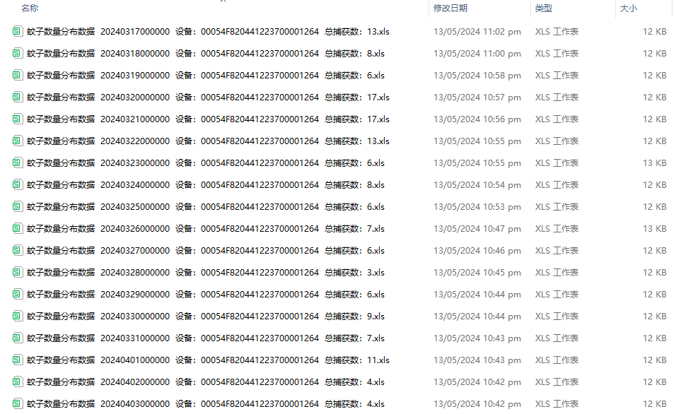

# MosqMK
A R package for analyzing unprocessed data collected by mosquito density monitoring instrument MK 300.

MosqMK是针对由南方医科大学开发的智能化蚊媒监测仪器MK300及相关产品等开发的集“数据整理”模块、“数据可视化”模块和“数据报告”模块工作流为一体的R包

## Installation 安装


MosqMK依赖的R包如下： readxl, tidyr, dplyr, ggplot2, cowplot

安装MosqMK包流程参考如下

```
library(devtools)
install_github('GuoXiang9399/MosqMK')
```


```
library(readxl)
library(lubridate)
library(tidyr)
library(dplyr)
library(fs)
library(MosqMK)
```  


## Usage 使用

（1）数据整理模块

1）函数MK_Data_Collect

可以批量汇总指定文件夹下的MK300原始导出数据

如下图demo文件夹下的多个原始数据文件



使用函数MK_Data_Collect，第一个参数为文件夹路径（Demo），第二个参数为设备ID（用户自己设定，如1223700001264）

```
all_data <- MK_Data_Collect("Demo","1223700001264")

```

汇总后得到的all_data我们预览如下

2）函数MK_Data_Filter

MK300原始数据中可能存在个别观测时间点有异常数据过大的情况，MosqMK包建议以每小时收集15只蚊虫为限进行数据筛选

使用函数MK_Data_Filter，第一个参数为纳入的数据，第二个参数为筛选限制


```
clean_data <- MK_Data_Filter(all_data,15)

```

(2)数据可视化模块

MK_Plot_Raw


MK_Plot_Week


MK_Plot_Month

(3)数据报告模块


开放中...

##  Contributing 开发
由南方医科大学热带医学研究所，南方医科大学公共卫生学院 郭祥 开发

如发现运行bug，请通过邮箱 guoxiang199399@163.com 联系我
