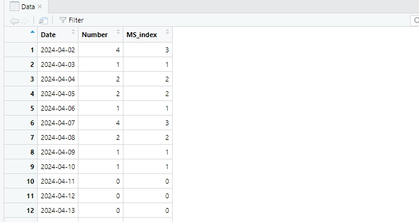

# MosqMK
MosqMK是针对由南方医科大学开发的智能化蚊媒监测仪器MS-300及相关产品等开发的集数据整理、数据可视化和数据报告工作流为一体的R包

MS-300的设计与应用详见论文Lai Z, Wu J, Xiao X, Xie L, Liu T, Zhou J, et al. (2022) Development and evaluation of an efficient and real-time monitoring system for the vector mosquitoes, Aedes albopictus and Culex quinquefasciatus. PLoS Negl Trop Dis 16(9):e0010701. https://doi.org/10.1371/journal.pntd.0010701

MS-300仪器数据下载可通过 https://www.smu.edu.cn/rdyjs/index.htm 或 http://app.moqong.com/admin/login.jhtml

## Installation 安装

安装MosqMK包可通过devtools工具，流程参考如下：

```
library(devtools)
install_github('GuoXiang9399/MosqMK')
```

MosqMK依赖的R包包括readxl, fs, lubridate, tidyr, dplyr, ggplot2, cowplot

加载MosqMK包和依赖的R包如下：

```
library(readxl)
library(fs)
library(lubridate)
library(tidyr)
library(dplyr)
library(ggplot2)
library(cowplot)
library(MosqMK)
```  


## Usage 使用 -- 数据整理模块

1) 函数MK_Data_Collect

可以批量汇总指定文件夹下的MS-300原始导出数据

如下图demo文件夹下的多个原始数据文件


使用函数MK_Data_Collect，第一个参数为文件夹路径（Demo），第二个参数为设备ID（用户自己设定，如1223700001264）

```
all_data <- MK_Data_Collect("Demo","1223700001264")
```

汇总后得到的all_data我们预览如下


2) MK_Data_Filter

MS-300原始数据中可能存在个别观测时间点有异常数据过大的情况，MosqMK包建议以每小时收集15只蚊虫为限进行数据筛选

使用函数MK_Data_Filter，第一个参数为纳入的数据，第二个参数为筛选限制

```
clean_data <- MK_Data_Filter(all_data,15)
```

3) MK_Data_Index

通过计算可获得与ADI等值的Index

```
data——index <- MK_Data_Index(all_data)
```



## Usage 使用 -- 数据可视化模块

1) MK_Plot_Raw

```
MK_Plot_Raw(clean_data)
```


2) MK_Plot_Factor

```
MK_Plot_Factor(clean_data)
```


3) MK_Plot_Week
```
MK_Plot_Week(clean_data)
```

#

4) MK_Plot_Month

```
MK_Plot_Month(clean_data)
```


## Usage 使用 -- 数据报告模块

开放中...

##  Contributing 开发
由南方医科大学热带医学研究所，南方医科大学公共卫生学院 郭祥 开发

如发现运行bug，请通过邮箱 guoxiang199399@163.com 联系我
